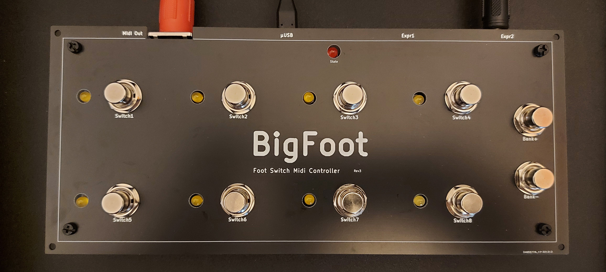
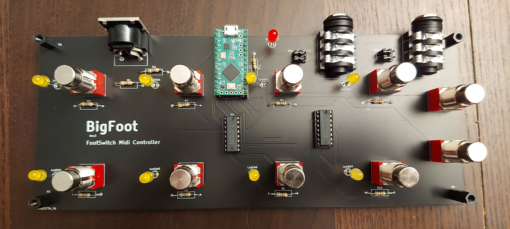

Big Foot
=========
Foot switch midi controller

Features
--------

    1. 8 assignable footswitches
    2. Bank selection
    3. 2 expression pedals connectors
    4. USB Midi input and output
    5. Midi DIN output
    6. (TODO) LED feedback

Presets Setup
-------------
Preset must be defined into a '.h' file in the Firmware/include folder, then included into Firmware/src/main.cpp file (see RolandMC707.h file as example) and compiled.

See [Control Surface](https://github.com/tttapa/Control-Surface) library for possible presets.

Building
--------

Folder structure:

- PCB: KiCAD schematics and PCB
    - Gerber: gerger files to order PCB production
- Enclosure: Enclosure files
- Firware: source code

Compiling source code requires [platformio](https://docs.platformio.org/en/latest/)

Licence
-------
[CC BY-NC 4.0](https://creativecommons.org/licenses/by-nc/4.0/)
